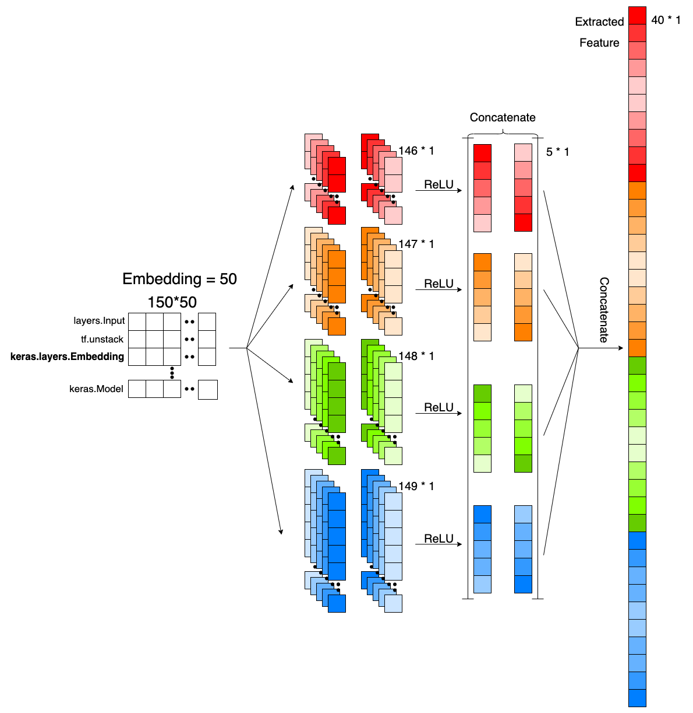
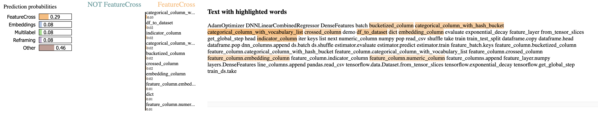

# MLDP Detection System — TextCNN

A text classification pipeline for **MLDP (Machine Learning Design Patterns)** category detection built with **TextCNN** (multi-kernel Conv1D, forward & reversed streams, GlobalMaxPool, Dropout, Softmax).
It provides a reproducible workflow: **data → tokenizer → training → evaluation (confusion matrices + per-class PRF bar charts) → LIME explanations**.


---

## setup (Python 3.10+)

```bash
python -m venv venv
source venv/bin/activate
pip install -r requirements.txt
```

---

## 1) Dataset & Motivation

This dataset was **collected from GitHub repositories** by the author. The goal is to study **Machine Learning Design Patterns** and contribute a practical resource for research and experimentation.

> **No external raw-data download is required to run the pipeline.**
> Ready-to-use splits are included:
>
> - `data/train_data.txt`
> - `data/val_data.txt`

If you still want the full raw bundle, you can optionally download it:

### Raw Data Availability
Raw data with machine learning design patterns can be downloaded by gdown:

```bash
# Optional: download the raw dataset (Google Drive via gdown)
# Requires: pip install gdown
bash scripts/download_data.sh
```
The script uses Google Drive (file id already set) and extracts the archive into `data/raw/`. You may also replace the file id in `scripts/download_data.sh` if you host the data elsewhere.

---

## 2) Project Structure

```
.
├── configs/
│   └── textcnn.yaml                 # Central configuration (data/tokenizer/model/train/output)
├── data/
│   ├── train_data.txt              # Ready-to-use train split: one sample per line "text\tlabel_id"
│   ├── val_data.txt                # Ready-to-use dev split:   one sample per line "text\tlabel_id"       
│   ├── labels/
│   │   └── id_to_name.json         # Optional: { "0": "ClassName0", ... }
│   └── processed/                  # Auto-generated by scripts
│       ├── tokenizer.json          # Keras tokenizer or HF tokenizer dir
│       └── stats.yaml              # Length percentiles, OOV coverage, etc.
├── models/
│   └── textcnn.py                  # TextCNN + ReverseTemporal (serializable)
├── scripts/
│   ├── build_tokenizer.py          # Fit & save tokenizer (whitespace or HF)
│   ├── train.py                    # Train entry (saves checkpoints and logs)
│   ├── evaluate.py                 # Evaluation + figures + reports
│   └── explain_lime.py             # LIME explanations for a single example
├── utils/
│   ├── data_io.py                  # Loading/vectorizing/one-hot, HF/Keras tokenizers
│   ├── preprocessing.py            # Augment & padding helpers
│   ├── metrics.py                  # Metrics & plotting
│   ├── seed.py                     # Seed control
│   └── logger.py                   # Logging
├── checkpoints/
│   └── textcnn/<YYYY-mm-dd_HH-MM-SS>/   # model.keras / metrics.json / config.yaml
└── results/
    ├── logs/                       # Training & evaluation logs/reports
    ├── figures/                    # Confusion matrices & per-class bar charts
    └── explanations/               # LIME HTML files
```

**Data format (TSV-like):**
Each line is `"<free text>\t<label_id>"`. Labels are 0-based integers (e.g., 0..10 for 11 classes).

---

## 3) Configuration (`configs/textcnn.yaml`)

This file drives the whole pipeline. Typical keys (reflecting the current defaults) are:

```yaml
data:
  train_path: data/train_data.txt
  dev_path:   data/val_data.txt
  labels_map_path: data/labels/id_to_name.json

tokenizer:
  mode: whitespace
  max_vocab_size: 20000
  oov_token: "[OOV]"
  keep_dot_and_underscore: true   # Use this if you want to preserve “.” and “_” in tokens like cv2.CascadeClassifier

sequence:
  max_len: 300                     # Start with 120, can later be fine-tuned based on data percentiles

model:
  embedding_size: 50
  filter_sizes: [2, 3, 4, 5]       # Newly add 6, 7 if needed
  num_filters: 64                   # 64 → try 96 (or 128 as an alternative)
  dropout: 0.6                      # Slightly stronger regularization
  l2_reg: 0.001    

train:
  batch_size: 64
  epochs: 25
  optimizer: adam
  loss: categorical_crossentropy
  focal_gamma: 1.8
  metrics: [accuracy]

  early_stopping_patience: 5
  save_best_only: true

  class_weight: balanced
  label_smoothing: 0.0

  lr_scheduler: reduce_on_plateau
  reduce_on_plateau:
    factor: 0.5
    patience: 2
    min_lr: 1e-5

num_classes: 11                     # Your labels are 0..10, total of 11 classes
seed: 2025

output:
  ckpt_dir: checkpoints/textcnn
  results_dir: results
```

### How to adjust the config

- **Use built-in splits:** Keep `data.train_path` and `data.dev_path` as above to run without downloading raw data.
- **Switch tokenizer mode:** `tokenizer.mode` can be `whitespace` or `hf`. For HF, run `build_tokenizer.py` with a valid HF tokenizer dir (see `data/processed/hf_tokenizer/`), and set `hf_model_name` in the script/config if needed.
- **Preserve code-like tokens:** Set `keep_dot_and_underscore: true` so tokens like `cv2.CascadeClassifier` remain intact.
- **Set sequence length:** After running `build_tokenizer.py`, open `data/processed/stats.yaml` and set `sequence.max_len` to `p95` (or `p99`) for a good balance between coverage and efficiency.
- **Capacity vs. regularization:** Increase `model.num_filters` and/or add `[6, 7]` to `filter_sizes` for extra capacity; tune `dropout`/`l2_reg` to prevent overfitting.
- **Imbalance handling:** Keep `train.class_weight: balanced` or switch to focal loss (set `train.loss: focal` and `train.focal_gamma`), but avoid double-weighting (the training script guards this).

---

## 4) End-to-End Workflow

Run from the project root using Python **module mode**:

```bash
# 1) Fit tokenizer (saves tokenizer + stats.yaml under data/processed/)
python -m scripts.build_tokenizer

# 2) Train TextCNN (saves timestamped checkpoint under checkpoints/textcnn/)
python -m scripts.train

# 3) Evaluate (confusion matrices, per-class bars, reports under results/)
python -m scripts.evaluate
# (Optional) Evaluate a specific checkpoint:
# python -m scripts.evaluate --ckpt checkpoints/textcnn/<YYYY-mm-dd_HH-MM-SS>
```

**Artifacts:**

- **Checkpoints:** `checkpoints/textcnn/<ts>/model.keras`, `metrics.json`, `config.yaml`
- **Figures:** `results/figures/confusion_matrix_counts_<ts>.png`, `confusion_matrix_normalized_<ts>.png`, per-class PRF charts
- **Reports:** `results/logs/classification_report_<ts>.txt`, `results/logs/eval_<ts>.txt`

---

## 5) Model Architecture (TextCNN)




> Suggested outline:
> - Embedding (size = 50)
> - Parallel Conv1D kernels (e.g., 2/3/4/5 [+ optional 6/7])
> - ReverseTemporal branch (optional reversed stream)
> - GlobalMaxPool + Concatenate
> - Dropout + Dense (softmax)
> - Any regularization tricks (L2, label smoothing, focal loss option)

---

## 6) LIME Explanations

Explainability is supported via **LIME** for single examples.



**Usage:**

```bash
# Explain the N-th dev sample (0-based index)
python -m scripts.explain_lime --index 28

# Or explain a custom text directly
python -m scripts.explain_lime --text "cv2.CascadeClassifier detectMultiScale"
```

**Outputs:**

- HTML saved under `results/explanations/`, e.g.  
  `lime_<YYYY-mm-dd_HH-MM-SS>_dev_idx-3_pred-<ClassName>_top10.html`
- Console prints the top contributing tokens with weights

> Notes:
> - The LIME explainer splits on whitespace and keeps `.` / `_` to align with the whitespace tokenizer.
> - For HF tokenizers, the sequence vectorization is handled internally; LIME operates on raw text with a wrapper `predict_fn`.

---

## 7) Troubleshooting

- **Imports fail (e.g., `ModuleNotFoundError: utils`)**: always run from project root with `python -m scripts.<name>`.
- **Empty configuration**: ensure `configs/textcnn.yaml` exists and matches the example above.
- **Tokenizer mismatch**: if >90% of predictions collapse into one class, verify that the tokenizer used during training and evaluation is the same; re-fit tokenizer and confirm `sequence.max_len`.
- **Model load issues**: `evaluate.py` registers `ReverseTemporal` in `custom_objects`; loading should work for both `.keras` and `.h5` models.

---

## 8) Acknowledgments / References

- Yoon Kim, *Convolutional Neural Networks for Sentence Classification*, EMNLP 2014.  
- Ribeiro et al., *“Why Should I Trust You?”: Explaining the Predictions of Any Classifier*, KDD 2016 (LIME).  
- Valliappa Lakshmanan, Sara Robinson, and Michael Munn, *Machine Learning Design Patterns*, O’Reilly, 2021.
